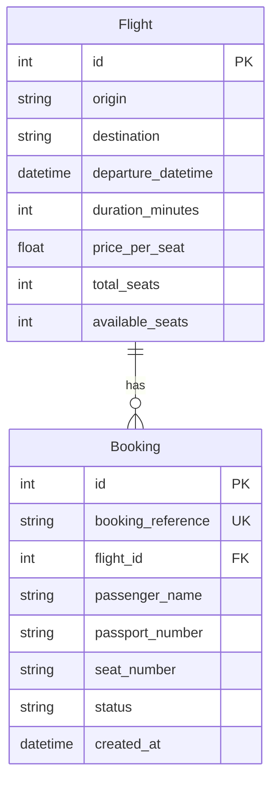

# FlightHub — architecture

## Overview

FlightHub is a small **FastAPI** backend plus **Express** static/HTML frontend. Persistence is **SQLite** (`backend/flighthub.db`) via **SQLAlchemy 2.x** ORM models. Request/response shapes use **Pydantic v2** (`backend/schemas.py`). The API is consumed by the browser UI on **`http://localhost:3000`**, with **CORS** restricted to that origin.

Layers:

- **HTTP** — FastAPI routers under `backend/routes/`, wired in `backend/main.py`.
- **Persistence** — Session per request via `get_db()` (`backend/database.py`).
- **Domain** — SQLAlchemy models (`backend/models.py`); validation DTOs (`backend/schemas.py`).

---

## Data model

### Entities

**`flights`**

| Column | Type | Notes |
|--------|------|--------|
| `id` | integer | Primary key |
| `origin` | string | Required |
| `destination` | string | Required |
| `departure_datetime` | datetime (tz-aware, stored as UTC) | Single departure instant |
| `duration_minutes` | integer | Block time |
| `price_per_seat` | float | Quoted price |
| `total_seats` | integer | Capacity |
| `available_seats` | integer | **Authoritative** remaining inventory for booking rules |

**`bookings`**

| Column | Type | Notes |
|--------|------|--------|
| `id` | integer | Primary key |
| `booking_reference` | string | **Unique**, generated server-side |
| `flight_id` | integer | FK → `flights.id` |
| `passenger_name` | string | Required |
| `passport_number` | string | Required |
| `seat_number` | string | Required (client-chosen label; see concurrency note below) |
| `status` | string | Default `confirmed`; used for cancellation |
| `created_at` | datetime (tz-aware UTC) | Audit |

**Relationships**

- `Flight.bookings` ↔ `Booking.flight` (many-to-one).

### Seed data

On startup, if `flights` is empty, the app inserts **8** sample rows with varied routes, pricing, and availability—including **two flights with only one seat left** to exercise capacity edge cases in tests and demos.

---

## API design

### Conventions

- **Success** — `2xx` with JSON bodies matching Pydantic schemas where applicable.
- **Validation** — Invalid body/query (e.g. bad date format) → **`422`** with clear `detail`.
- **Not found** — Missing resource or empty search (where specified) → **`404`** with an explicit string `detail` for UX and tests.
- **CORS** — `allow_origins: ["http://localhost:3000"]` so only the local Express UI calls the API from the browser.

### Flights (implemented)

| Method & path | Purpose | Responses |
|---------------|---------|-----------|
| `GET /flights` | List all flights | **200** — `[FlightResponse, …]` |
| `GET /flights/search` | Optional query: `origin`, `destination`, `date` (`YYYY-MM-DD`) | **200** — matches; **404** — `No flights found matching your criteria`; **422** — invalid `date` |
| `GET /flights/{flight_id}` | Flight by id | **200** — `FlightResponse`; **404** — `Flight not found` |

**Filtering rules**

- **Origin / destination** — Case-insensitive **equality** on stored city strings (normalized with `lower()` on both sides).
- **Date** — Interpret `date` as a **UTC calendar day**: `[day 00:00:00 UTC, next day 00:00:00 UTC)`. This fixes ambiguity between “date only” in the UI and a full timestamp in the database.

### Bookings (planned; models & schemas ready)

Aligned with `TASK.md`; endpoints will live on a dedicated router (e.g. `/bookings`) and use `BookingCreate`, `BookingResponse`, and `CancellationResponse`:

- **Create booking** — Validate input, ensure flight exists, enforce **overbooking rule** (below), decrement `available_seats`, persist booking with a **new unique `booking_reference`**.
- **List / lookup** — By passenger name and/or booking reference; return nested **flight details** in each `BookingResponse`.
- **Cancel** — By reference: mark booking cancelled (or delete, per final choice), increment `available_seats` on the flight, return a small **cancellation** payload.

HTTP mapping will follow the same style: **404** for unknown flight/reference, **409** or **422** when a business rule blocks the action (see overbooking).

---

## How ambiguities were resolved

### 1. “Handle overbooking appropriately” (`TASK.md`)

**Decision:** **Reject** a new booking when there is **no remaining inventory**: `available_seats <= 0` before the transaction commits.

**Mechanism (intended implementation):** Perform flight load + capacity check + insert booking + decrement seats inside **one database transaction**. Optionally verify **`available_seats > 0`** again immediately before update to reduce race windows; if two requests compete for the last seat, one succeeds and the other gets **`409 Conflict`** (or **`422`**) with a clear message such as *“No seats available on this flight.”*

**Rationale:** The agency must never show negative availability or silently double-sell the last seat. Failing fast with a **specific error** is clearer than a waitlist or queue, which are out of scope for this tool.

**Seat number:** The client supplies a **seat label** (e.g. `12A`). The server **does not** model a per-seat matrix in v1; **capacity** is enforced only via **`available_seats`**. Double assignment of the same seat label is acceptable for this assessment unless extended with a uniqueness constraint per flight later.

### 2. “Display relevant flight information” / UI priorities (`TASK.md`)

**Decision:** The **Express** UI will prioritize, in order:

1. **Browse & search** — Table (or cards) of flights with **origin, destination, departure (local or ISO), duration, price, seats available**; search fields for origin, destination, and date.
2. **Book** — Form: flight id (or pick from list), passenger name, passport, seat; show **API errors** inline.
3. **Look up & cancel** — Inputs for **booking reference** and/or **passenger name**; list results with **status** and **flight summary**; cancel by reference with confirmation.

**Rationale:** Staff workflow is **find a flight → book → later find/cancel**; the layout follows that sequence with minimal chrome.

### 3. Other small design choices

| Topic | Resolution |
|--------|------------|
| **Empty flight search** | **`404`** with fixed copy (as implemented) so the UI can distinguish “no matches” from “success + empty list” on list-all. |
| **Booking reference format** | **Opaque unique string** (e.g. UUID or short alphanumeric) generated **only on the server**; not client-supplied. |
| **Cancellation** | **Soft** status change vs **hard** delete TBD in implementation; either way **`available_seats` must increase** when a confirmed seat is released. |

