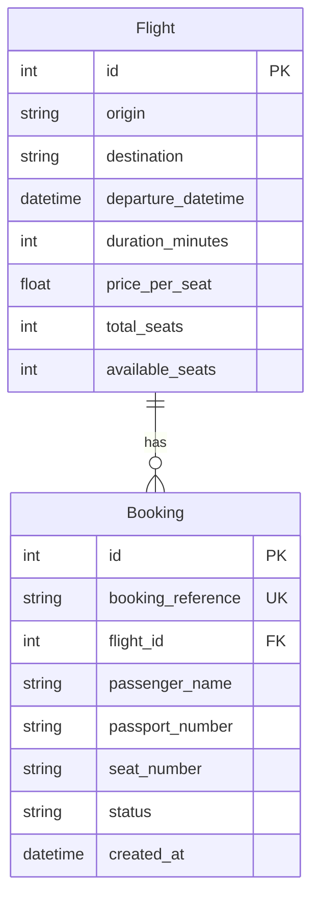

# FlightHub — architecture

## Overview

FlightHub is a small **FastAPI** backend plus **Express** static/HTML frontend. Persistence is **SQLite** (`backend/flighthub.db`) via **SQLAlchemy 2.x** ORM models. Request/response shapes use **Pydantic v2** (`backend/schemas.py`). The API is consumed by the browser UI on **`http://localhost:3000`**, with **CORS** restricted to that origin.

Layers:

- **HTTP** — FastAPI routers under `backend/routes/`, wired in `backend/main.py`.
- **Persistence** — Session per request via `get_db()` (`backend/database.py`).
- **Domain** — SQLAlchemy models (`backend/models.py`); validation DTOs (`backend/schemas.py`).

---

## Data model

### Entities

**`flights`**

| Column | Type | Notes |
|--------|------|--------|
| `id` | integer | Primary key |
| `origin` | string | Required |
| `destination` | string | Required |
| `departure_datetime` | datetime (tz-aware, stored as UTC) | Single departure instant |
| `duration_minutes` | integer | Block time |
| `price_per_seat` | float | Quoted price |
| `total_seats` | integer | Capacity |
| `available_seats` | integer | **Authoritative** remaining inventory for booking rules |

**`bookings`**

| Column | Type | Notes |
|--------|------|--------|
| `id` | integer | Primary key |
| `booking_reference` | string | **Unique**, generated server-side |
| `flight_id` | integer | FK → `flights.id` |
| `passenger_name` | string | Required |
| `passport_number` | string | Required |
| `seat_number` | string | Required (client-chosen label; see concurrency note below) |
| `status` | string | Default `confirmed`; used for cancellation |
| `created_at` | datetime (tz-aware UTC) | Audit |

**Relationships**

- `Flight.bookings` ↔ `Booking.flight` (many-to-one).

### Seed data

On startup, if `flights` is empty, the app inserts **8** sample rows with varied routes, pricing, and availability—including **two flights with only one seat left** to exercise capacity edge cases in tests and demos.

---

## API design

### Conventions

- **Success** — `2xx` with JSON bodies matching Pydantic schemas where applicable.
- **Validation** — Invalid body/query (e.g. bad date format) → **`422`** with clear `detail`.
- **Not found** — Missing resource or empty search (where specified) → **`404`** with an explicit string `detail` for UX and tests.
- **CORS** — `allow_origins: ["http://localhost:3000"]` so only the local Express UI calls the API from the browser.

### Flights (implemented)

| Method & path | Purpose | Responses |
|---------------|---------|-----------|
| `GET /flights` | List all flights | **200** — `[FlightResponse, …]` |
| `GET /flights/search` | Optional query: `origin`, `destination`, `date` (`YYYY-MM-DD`) | **200** — matches; **404** — `No flights found matching your criteria`; **422** — invalid `date` |
| `GET /flights/{flight_id}` | Flight by id | **200** — `FlightResponse`; **404** — `Flight not found` |

**Filtering rules**

- **Origin / destination** — Case-insensitive **equality** on stored city strings (normalized with `lower()` on both sides).
- **Date** — Interpret `date` as a **UTC calendar day**: `[day 00:00:00 UTC, next day 00:00:00 UTC)`. This fixes ambiguity between “date only” in the UI and a full timestamp in the database.

### Bookings (implemented — `backend/routes/bookings.py`)

| Method & path | Purpose | Responses |
|---------------|---------|-----------|
| `POST /bookings` | Create booking (`BookingCreate`) | **201** — `BookingResponse` (nested `flight`); **404** — `Flight not found`; **409** — `No seats available on this flight` |
| `GET /bookings` | Search by `passenger_name` (optional) and/or `booking_reference` (optional) | **200** — `[BookingResponse, …]` with `selectinload(flight)`; **400** — `Provide passenger_name or booking_reference to search` if both missing/blank |
| `DELETE /bookings/{booking_reference}` | Cancel by reference | **200** — `CancellationResponse`; **404** — `Booking not found`; **409** — `Booking is already cancelled` |

**Create flow (order enforced in code)**

1. Load **`Flight`** by **`flight_id`** — **404** if missing.
2. If **`available_seats <= 0`** — **409** with the message above (no negative inventory).
3. Generate **`booking_reference`**: **`uuid.uuid4().hex[:8].upper()`** (8 hex characters; unique in DB via column constraint).
4. Insert **`Booking`** with **`status="confirmed"`**, decrement **`available_seats`** by 1, **`commit`**.

**Search rules**

- At least one of **`passenger_name`** or **`booking_reference`** must be provided (non-empty after strip); otherwise **400**.
- **Name** — case-insensitive **substring** match (`instr` on lowercased columns).
- **Reference** — **exact** string match.
- If **both** query params are present, filters combine with **`OR`** (broader lookup consistent with “name or reference” in `TASK.md`).

**Cancellation**

- **Soft cancel:** set **`status`** to **`cancelled`**, increment **`flight.available_seats`** by **1**, **`commit`**. Second cancel on the same reference → **409**.

---

## Testing

Automated API tests live under **`tests/`** (`pytest` + Starlette **`TestClient`**). They exercise **real** FastAPI routing and **real** SQLAlchemy persistence—**no** mocked database layer.

| File | Role |
|------|------|
| **`tests/conftest.py`** | **Autouse** fixture: in-memory SQLite engine with **`StaticPool`** (required so `:memory:` is shared across connections); **`drop_all` / `create_all`** each test; seed **two** `Flight` rows (**`available_seats`** **1** and **5**); **`monkeypatch`** `backend.database` and **`backend.main`** (`engine`, `SessionLocal`, no-op **`_seed_sample_flights_if_empty`**) so startup never writes **`flighthub.db`**; **`app.dependency_overrides[get_db]`** yields sessions bound to the test engine. |
| **`tests/test_api.py`** | Six tests: list flights (**200**, non-empty), search by origin (**200**, matching rows), successful booking (**201**, **`booking_reference`**, **`confirmed`**), **overbooking** on the single-seat flight (**201** then **409**—**business rule**), cancel restores **inventory**, double cancel (**409**). |

Run from repo root: **`python -m pytest tests/test_api.py -v`**.

---

## How ambiguities were resolved

### 1. “Handle overbooking appropriately” (`TASK.md`)

**Decision:** **Reject** a new booking when there is **no remaining inventory**: `available_seats <= 0` before the transaction commits.

**Mechanism (implemented in `POST /bookings`):** Flight load, **`available_seats`** check, booking insert, and seat decrement run in **one `Session` transaction** ending in **`commit`**. Under concurrency, the second request for the last seat should see **`available_seats <= 0`** and receive **409** with *“No seats available on this flight.”* (SQLite serializes writers; a future **`SELECT … FOR UPDATE`** could tighten this on other engines.)

**Rationale:** The agency must never show negative availability or silently double-sell the last seat. Failing fast with a **specific error** is clearer than a waitlist or queue, which are out of scope for this tool.

**Seat number:** The client supplies a **seat label** (e.g. `12A`). The server **does not** model a per-seat matrix in v1; **capacity** is enforced only via **`available_seats`**. Double assignment of the same seat label is acceptable for this assessment unless extended with a uniqueness constraint per flight later.

### 2. “Display relevant flight information” / UI priorities (`TASK.md`)

**Decision:** The **Express** UI will prioritize, in order:

1. **Browse & search** — Table (or cards) of flights with **origin, destination, departure (local or ISO), duration, price, seats available**; search fields for origin, destination, and date.
2. **Book** — Form: flight id (or pick from list), passenger name, passport, seat; show **API errors** inline.
3. **Look up & cancel** — Inputs for **booking reference** and/or **passenger name**; list results with **status** and **flight summary**; cancel by reference with confirmation.

**Rationale:** Staff workflow is **find a flight → book → later find/cancel**; the layout follows that sequence with minimal chrome.

### 3. Other small design choices

| Topic | Resolution |
|--------|------------|
| **Empty flight search** | **`404`** with fixed copy (as implemented) so the UI can distinguish “no matches” from “success + empty list” on list-all. |
| **Booking reference format** | **Server-generated** **8-character uppercase hex** from **`uuid4`** (`hex[:8]`); not client-supplied. |
| **Cancellation** | **Soft** cancel: **`status = cancelled`** and **`available_seats += 1`** on the related flight (`DELETE /bookings/{booking_reference}`). |

